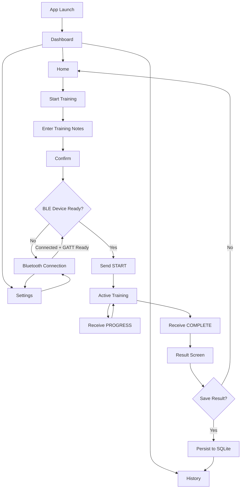
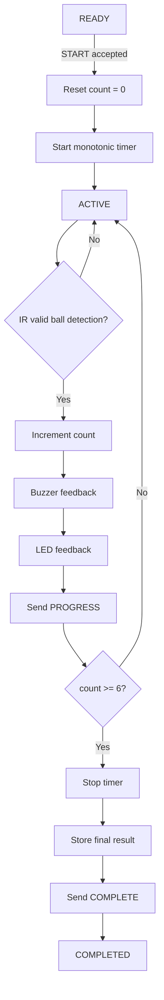
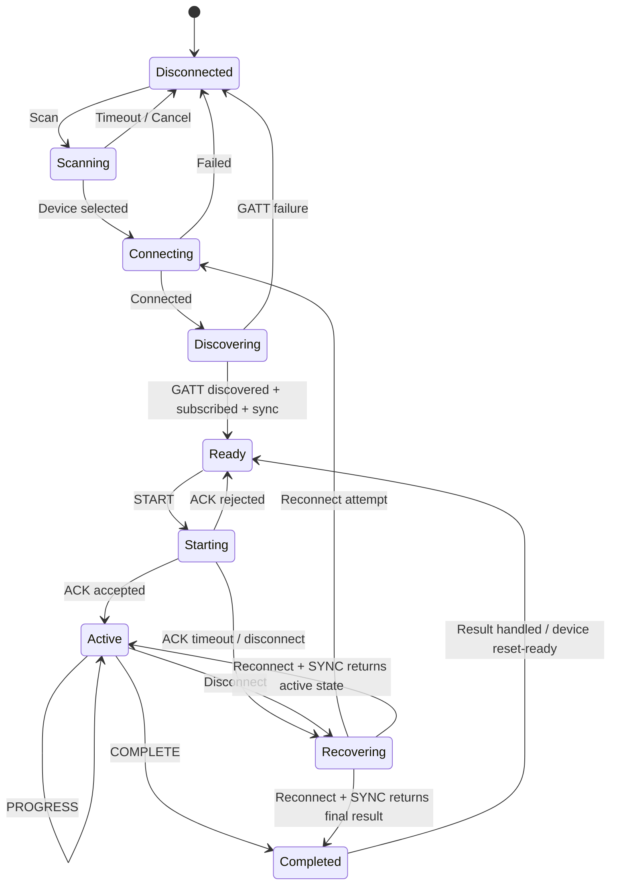
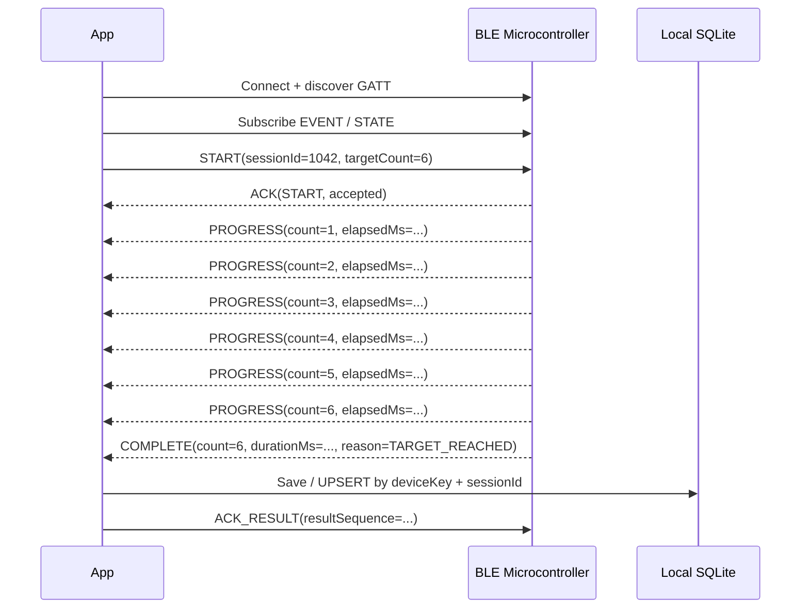
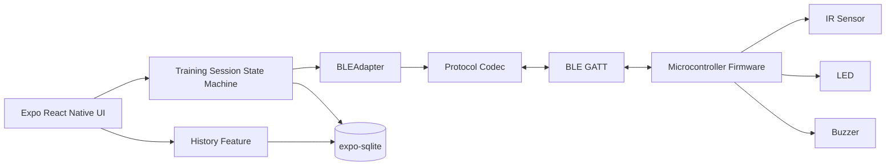

# Product Requirements Document

## BLE Training App & IoT Device

**Expo React Native mobile application connected to a BLE microcontroller**

> Source flow interpreted from the uploaded diagrams.net flowchart **“Flow Aplikasi”**.

| Metadata | Value |
|---|---|
| Document version | 1.0 |
| Date | 27 August 2026 |
| Product stage | MVP / implementation-ready |
| Primary client | Expo React Native (SDK 57 baseline) |
| Connectivity | Bluetooth Low Energy (BLE), offline-first |

---

## 1. Executive Summary

This PRD defines a mobile training application that connects to a BLE-enabled microcontroller. The mobile app creates and manages a training session; the microcontroller is the authoritative source for sensor counting and elapsed time.

During a session, an IR sensor detects balls, the device increments the counter, provides immediate buzzer and LED feedback, and completes the session when the count reaches **six**. The final duration and count are transmitted to the mobile app, where the user can save the result to local History.

The app is designed to work without internet access. BLE is used for device discovery, connection, commands, progress events, session recovery, and final result transfer.

The mobile implementation uses Expo React Native with a **custom development build**, because BLE requires native code and is therefore not an Expo Go-only workflow.

> **MVP rule:** The target is fixed at **6 valid ball detections**, matching the source flow. The BLE protocol carries `targetCount` so the product can make this configurable later without changing the protocol shape.

---

## 2. Problem Statement

Training results are currently produced by physical sensors and device-side timing, but users need a simple mobile workflow to:

1. connect to the training device,
2. start a training session,
3. observe progress,
4. receive the final result,
5. save or discard that result, and
6. review previous sessions.

The solution must remain reliable when connectivity is intermittent and must not make the phone the source of truth for sensor events or timing.

---

## 3. Product Goals and Non-Goals

### 3.1 Goals

- Provide a simple **Home → Start Training → Result → Save** workflow.
- Pair and reconnect to one BLE training device from Settings.
- Use the microcontroller as the authoritative timer and ball counter.
- Show live session progress when BLE notifications are available.
- Persist completed training results locally and display them in History.
- Recover a session result after a temporary BLE disconnect.
- Keep mobile and firmware implementation decoupled through a versioned BLE contract.

### 3.2 Non-Goals for MVP

- Cloud account, authentication, remote sync, coach portal, or web dashboard.
- Multi-device simultaneous sessions.
- Firmware over-the-air update from the app.
- Background training execution managed by the phone; the microcontroller continues independently.
- Configurable target counts, training templates, or leaderboard features.
- Classic Bluetooth; only Bluetooth Low Energy is in scope.

---

## 4. Primary User and Core Use Cases

| Actor | Need | Success condition |
|---|---|---|
| Trainee / operator | Connect the phone to the training device | App shows Connected / Ready and the device identity. |
| Trainee / operator | Start a six-ball training session | Device acknowledges `START` and begins timing/counting exactly once. |
| Trainee / operator | See training progress | App mirrors count and elapsed time without becoming the source of truth. |
| Trainee / operator | Save or discard a result | Saved session appears in History; discard returns to Home. |
| Support / technician | Diagnose connectivity | Settings exposes device ID, connection state, firmware version if available, and reconnect controls. |

---

## 5. Source Flow Interpretation

The uploaded flow contains two connected flows:

1. mobile navigation and result saving,
2. microcontroller execution and sensor loop.

The cleaned product flow preserves the original intent while adding an explicit **device-ready gate** before `START` so the product cannot enter a broken training state.

### 5.1 Mobile Product Flow



### 5.2 Source Labels → Product Screens

| Source flow label | PRD interpretation |
|---|---|
| Mulai | App launch / initialization |
| Dashboard | Root navigation |
| Home | Primary training entry screen |
| History | Saved result list and detail |
| Pengaturan | Settings |
| Koneksi Bluetooth | BLE device connection screen |
| Mulai Latihan | Start Training flow |
| Isi Keterangan Latihan | Training notes / description form |
| Klik Ok | Confirm metadata |
| Tombol Start Latihan | Start Session action |
| Simpan Hasil Latihan | Save / discard result decision |
| Scroll hasil latihan | Browse result history |

---

## 6. User Experience Requirements

### 6.1 Dashboard

- Provides navigation to **Home**, **History**, and **Settings**.
- Shows a compact BLE status indicator:
  - Disconnected
  - Connecting
  - Ready
  - Active
- Does not automatically trigger an OS Bluetooth permission prompt before the user enters a BLE-related flow unless required by the selected native library.

### 6.2 Home

- Primary CTA: **Start Training**.
- Shows last saved result summary when one exists.
- If no device is ready, Start Training may collect notes, but the final **Start Session** action must route the user through connection setup before sending `START`.

### 6.3 Start Training / Notes

| Field | Type | MVP rule |
|---|---|---|
| Training notes | Multiline text | Optional; trim whitespace; max 500 characters. |
| Target count | Hidden/defaulted | Fixed to 6 in MVP. |
| Session ID | Generated | 32-bit unsigned identifier generated by the app for BLE idempotency; local DB uses a UUID string. |

### 6.4 Bluetooth Connection

- Request required OS Bluetooth permissions only when BLE is needed.
- Show adapter state and explain how to enable Bluetooth when off.
- Scan only for devices advertising the product service UUID when firmware supports service filtering; otherwise scan and filter by service/manufacturer data.
- Display:
  - human-readable device name,
  - stable device identifier where the OS exposes one,
  - RSSI during scan.
- Allow one active peripheral connection.
- Selecting a new device disconnects the previous device first.
- After connection:
  1. discover the required GATT service/characteristics,
  2. subscribe to event notifications,
  3. perform initial state sync,
  4. only then report **Ready**.
- Remember the last successful peripheral identity for best-effort reconnect.

### 6.5 Active Training

- Show connection status.
- Show ball count as `n / 6`.
- Show elapsed time.
- The phone timer is display-only; final duration must come from the microcontroller.
- Update ball count from `PROGRESS` notifications.
- If notifications are delayed, the device LED remains the physical source of immediate feedback.
- Disable duplicate Start actions after `START` is accepted.
- If BLE disconnects, show:

  > Device disconnected — session may still be running on the device.

- Enter recovery rather than immediately failing the session.
- Optional **Stop Session** is allowed only if firmware supports `STOP`; stopping must produce a completed/cancelled reason code.

### 6.6 Result and Save

On `COMPLETE`, show:

- final count,
- authoritative duration,
- start timestamp,
- completion timestamp,
- notes,
- device name.

Actions:

- **Save Result** — primary action.
- **Discard** — secondary action.

Save must be idempotent by session ID to avoid duplicate History entries after reconnect or repeated `COMPLETE` notifications.

After save, navigate to History or result detail. After discard, navigate to Home.

### 6.7 History

- List saved sessions newest first.
- Each row shows:
  - date/time,
  - notes preview,
  - final count,
  - duration.
- Tap opens a result detail view.
- MVP History is local to the device and works offline.

---

## 7. Microcontroller Training Flow

The microcontroller owns the deterministic session loop. The app sends intent; the device validates and executes it. Sensor events are never inferred from the phone.



### 7.1 Firmware Functional Requirements

| ID | Priority | Requirement |
|---|---|---|
| FW-001 | P0 | Advertise a custom BLE service that uniquely identifies the training device. |
| FW-002 | P0 | Accept `START` only when device state is `READY`; acknowledge the accepted session ID. |
| FW-003 | P0 | Start the authoritative monotonic timer only after `START` is accepted. |
| FW-004 | P0 | Debounce / qualify IR detections so one physical ball produces one logical increment. |
| FW-005 | P0 | Increment counter and emit buzzer + LED feedback for every valid detection. |
| FW-006 | P0 | Send a `PROGRESS` notification containing session ID, count, and elapsed time after each valid detection. |
| FW-007 | P0 | When counter reaches 6, stop the timer exactly once, display the result, and emit `COMPLETE`. |
| FW-008 | P0 | Retain the latest completed result until it is acknowledged by the app or replaced by a newer session, enabling reconnect recovery. |
| FW-009 | P0 | Reject duplicate `START` for the same active session ID without resetting timer/counter. |
| FW-010 | P1 | Expose firmware version and device serial/model through Device Information or a custom characteristic. |

---

## 8. BLE Connection and Session State



### 8.1 Connection Rules

1. **Connected is not equal to Ready.**
   - Ready requires service discovery,
   - successful event subscription,
   - initial state read/sync.
2. Control commands use **GATT Write With Response** so the app knows the OS accepted the write.
3. Application-level `ACK` confirms the firmware accepted the command.
4. Event/telemetry uses **Notify**.
5. The app subscribes before `START` to avoid missing the first state/event transition.
6. A `START` request times out if no application `ACK` arrives within **3 seconds**.
7. The UI may retry once only after checking current device state/session ID.
8. During an active session, reconnect attempts should use bounded backoff.
9. After reconnection, issue `SYNC` / get-last-result rather than sending `START` again.

---

## 9. BLE GATT Contract — Protocol v1

> **UUID ownership:** Use generated 128-bit custom UUIDs and store them in a shared mobile/firmware constants specification. UUIDs below are logical names, not final numeric values.

### 9.1 Characteristics

| Characteristic | Direction | Properties | Purpose |
|---|---|---|---|
| `CONTROL` | App → Device | Write with response | `START`, `STOP`, `SYNC`, `ACK_RESULT` |
| `EVENT` | Device → App | Notify | `ACK`, `PROGRESS`, `COMPLETE`, `ERROR`, `STATE_CHANGED` |
| `STATE` | Device → App | Read + Notify | Current state, active session ID, current count, elapsed time |
| `DEVICE_INFO` | Device → App | Read | Protocol version, firmware version, model/serial if available |

### 9.2 Packet Envelope

Protocol v1 uses compact fixed-field binary messages to avoid dependence on large BLE MTUs. Multi-byte integers are **little-endian**.

BLE already provides link-layer integrity, so an application CRC is not required for MVP.

| Field | Size | Description |
|---|---:|---|
| `version` | 1 byte | Protocol version; initial value `0x01`. |
| `messageType` | 1 byte | Command or event code. |
| `sessionId` | 4 bytes | Unsigned session identifier; zero for device-level messages. |
| `sequence` | 2 bytes | Per-session incrementing sequence number for deduplication/order checks. |
| `payload` | 0..N bytes | Message-specific payload; keep v1 packets conservatively small where possible. |

### 9.3 Message Types

| Type | Direction | Payload | Meaning |
|---|---|---|---|
| `0x01 START` | App → Device | `targetCount:u8` (`6`) | Begin a new session; device responds `ACK`. |
| `0x02 STOP` | App → Device | `reason:u8` | Optional operator cancel/stop. |
| `0x03 SYNC` | App → Device | none | Request current `STATE` and last result. |
| `0x04 ACK_RESULT` | App → Device | `resultSequence:u16` | Tell device final result has been persisted/handled. |
| `0x81 ACK` | Device → App | `command:u8,status:u8` | Command accepted/rejected. |
| `0x82 PROGRESS` | Device → App | `count:u8,elapsedMs:u32` | Valid ball detection/current authoritative elapsed time. |
| `0x83 COMPLETE` | Device → App | `count:u8,durationMs:u32,reason:u8` | Final session result. |
| `0x84 STATE` | Device → App | `state:u8,count:u8,elapsedMs:u32` | Snapshot for initial sync and reconnect. |
| `0xFF ERROR` | Device → App | `errorCode:u16` | Protocol/device error. |

### 9.4 Device State Codes

| Code | State | Meaning |
|---:|---|---|
| `0` | `READY` | Connected and able to accept `START`. |
| `1` | `ACTIVE` | Timer running; sensor events accepted. |
| `2` | `COMPLETED` | Final result available and retained for sync. |
| `3` | `ERROR` | Device cannot start/continue until recovered/reset. |

### 9.5 Example Session Sequence



---

## 10. Mobile Technical Architecture

### 10.1 System Architecture



### 10.2 Recommended Mobile Baseline

| Area | Recommendation | Reason |
|---|---|---|
| Framework | Expo SDK 57 + React Native 0.86 + TypeScript | Current Expo baseline at PRD date; native development build supports custom BLE modules. |
| Navigation | Expo Router | File-based navigation and standard Expo integration. |
| BLE | `react-native-ble-manager` behind an internal `BLEAdapter` interface | Supports modern React Native and provides Expo integration; validate on target hardware in a technical spike. |
| State | Zustand | Small connection/session state machine without coupling BLE events directly to screens. |
| Persistence | `expo-sqlite` | Structured local History with unique session constraint and offline operation. |
| Build | `expo-dev-client` + EAS Build or `npx expo run:*` | BLE uses native code; Expo Go is not the target runtime. |
| Testing | Jest/unit + Maestro E2E + physical BLE device matrix | BLE reliability cannot be validated only in simulators. |

> **BLE library risk:** `react-native-ble-plx` is also a viable adapter. Keep BLE behind an interface so the native library can be swapped without rewriting product logic.

### 10.3 Suggested Module Boundaries

```text
app/
  # Expo Router route files only; minimal business logic

src/
  features/
    bluetooth/
      # permissions, scanner, connection manager,
      # GATT discovery, reconnect policy
    training/
      # session state machine, training form,
      # active session, result handling
    history/
      # SQLite repository, list/detail queries

  store/
    # BLE and training Zustand stores/selectors

  protocol/
    # shared/generated UUID constants,
    # message codes, encoders/decoders

  components/
    # reusable UI and connection-state primitives
```

### 10.4 Suggested Mobile State Model

```ts
type BleState =
  | 'disconnected'
  | 'scanning'
  | 'connecting'
  | 'discovering'
  | 'ready'
  | 'recovering';

type TrainingState =
  | 'idle'
  | 'starting'
  | 'active'
  | 'completed'
  | 'cancelled'
  | 'error';
```

Business logic should live in feature/state-machine modules rather than React screens.

---

## 11. Data Model and Persistence

### 11.1 `TrainingSession`

| Field | Type | Requirement |
|---|---|---|
| `id` | TEXT UUID | Primary key for local storage. |
| `bleSessionId` | INTEGER | Unique 32-bit session ID used by protocol. |
| `notes` | TEXT NULL | Optional description, max 500 chars. |
| `targetCount` | INTEGER | 6 for MVP. |
| `finalCount` | INTEGER | Normally 6 for COMPLETE; retain actual count for cancelled/error results if supported. |
| `durationMs` | INTEGER | Authoritative device duration. |
| `startedAt` | ISO timestamp | App timestamp recorded when `START ACK` is received. |
| `completedAt` | ISO timestamp | App timestamp recorded on `COMPLETE` receipt/recovery. |
| `deviceKey` | TEXT | Stable app-side key for the peripheral/device. |
| `status` | TEXT | `completed`, `cancelled`, or `recovered`; only saved results appear in default History. |
| `protocolVersion` | INTEGER | Allows future decoding/migration diagnostics. |

### 11.2 Idempotency Constraint

Create a unique constraint on:

```text
(deviceKey, bleSessionId)
```

Repeated `COMPLETE` / `SYNC` packets update the same record instead of inserting duplicates.

Suggested SQL:

```sql
CREATE TABLE training_sessions (
  id TEXT PRIMARY KEY NOT NULL,
  ble_session_id INTEGER NOT NULL,
  notes TEXT,
  target_count INTEGER NOT NULL DEFAULT 6,
  final_count INTEGER NOT NULL,
  duration_ms INTEGER NOT NULL,
  started_at TEXT NOT NULL,
  completed_at TEXT NOT NULL,
  device_key TEXT NOT NULL,
  status TEXT NOT NULL,
  protocol_version INTEGER NOT NULL DEFAULT 1,
  UNIQUE(device_key, ble_session_id)
);
```

---

## 12. Functional Requirements

### 12.1 Mobile Requirements

| ID | Priority | Requirement |
|---|---|---|
| MOB-001 | P0 | App exposes Dashboard, Home, History, and Settings navigation. |
| MOB-002 | P0 | User can enter optional training notes and confirm before starting. |
| MOB-003 | P0 | Start Session is blocked until BLE state is Ready. |
| MOB-004 | P0 | App generates a BLE session ID and sends `START(targetCount=6)`. |
| MOB-005 | P0 | App transitions to Active only after firmware ACK accepts START. |
| MOB-006 | P0 | App renders count and elapsed time from device `PROGRESS` / `STATE` events. |
| MOB-007 | P0 | App displays final result from `COMPLETE` and offers Save / Discard. |
| MOB-008 | P0 | Saved results persist in SQLite and appear in History after app restart. |
| MOB-009 | P0 | App automatically attempts reconnect during an active session and performs `SYNC` after reconnect. |
| MOB-010 | P0 | App prevents duplicate saves and duplicate session starts using session IDs. |
| MOB-011 | P1 | App remembers last connected device for best-effort reconnect. |
| MOB-012 | P1 | Settings shows protocol/firmware version when exposed by the device. |

### 12.2 BLE Requirements

| ID | Priority | Requirement |
|---|---|---|
| BLE-001 | P0 | App requests Android/iOS Bluetooth permissions according to OS version and product use. |
| BLE-002 | P0 | App scans, connects, discovers required service/characteristics, subscribes, and only then reports Ready. |
| BLE-003 | P0 | `START` uses write-with-response plus application ACK. |
| BLE-004 | P0 | Events include session ID and sequence to support deduplication and recovery. |
| BLE-005 | P0 | App handles adapter-off, permission-denied, scan timeout, connect timeout, GATT discovery failure, command timeout, and disconnect. |
| BLE-006 | P0 | App ignores events for a non-current session unless returned explicitly as last-result recovery data. |
| BLE-007 | P1 | RSSI may be displayed during scanning but is not a session-quality metric. |

---

## 13. Error Handling and Recovery

| Scenario | Required behavior |
|---|---|
| Bluetooth permission denied | Explain why BLE is required; provide Retry / Open Settings where supported; do not crash. |
| Bluetooth adapter off | Show adapter-off state. Android may offer enable flow if supported; otherwise instruct user to enable Bluetooth. |
| No device found | End scan after a bounded interval, show Retry, and keep last-connected device hint. |
| Connection/GATT discovery fails | Disconnect stale handle, show error, allow retry. |
| `START` write succeeds but no ACK | Read `STATE` before retry. Never blindly send a second `START` that could reset an active device session. |
| Disconnect while ACTIVE | Keep local session in Recovering; attempt reconnect; on success issue `SYNC`. MCU continues independently. |
| `COMPLETE` received twice | Deduplicate by `deviceKey + sessionId` and sequence. |
| App killed during session | On next launch, reconnect to last device and `SYNC`. If device retains a completed result, restore it into Result flow. |
| Sensor error / device `ERROR` | Stop mobile active state, show device error code, preserve diagnostics, and do not fabricate a result. |

### 13.1 Recovery Principle

The mobile app must assume that **loss of BLE connection does not imply loss of the training session**.

The MCU owns session continuity. After reconnect:

1. app restores GATT subscriptions,
2. app sends `SYNC`,
3. device responds with current or last-completed session state,
4. app reconciles using `sessionId` and `sequence`,
5. app resumes Active or displays recovered Result.

---

## 14. Non-Functional Requirements

| Category | Requirement |
|---|---|
| Offline | Core connect/start/train/save/history flow must require no network. |
| Responsiveness | UI should reflect a `PROGRESS` notification within 250 ms of delivery to JavaScript under normal foreground conditions. |
| Reliability | No duplicate `START` or duplicate saved result under reconnect/retry scenarios. |
| Device authority | Final count/duration must always come from MCU `COMPLETE` / `STATE`, never from a phone-only calculation. |
| Battery | Scanning stops immediately after connection or scan timeout; continuous scanning is prohibited. |
| Accessibility | Controls have meaningful labels, readable contrast, scalable text, and non-color-only connection states. |
| Platform | MVP targets current supported iOS/Android versions compatible with the selected Expo SDK and BLE library; physical-device testing is mandatory. |
| Maintainability | BLE native library is wrapped behind an adapter and protocol codec is independent from UI. |
| Privacy | Training notes/results remain local in MVP; no cloud transmission without a later explicit product requirement. |

---

## 15. Security and BLE Safety

- Do not treat a BLE device name as trusted identity.
- Prefer service UUID plus manufacturer/service data and a device-provisioned identifier when available.
- Use OS BLE pairing/bonding only if the product threat model requires it; otherwise keep the control surface limited and session-scoped.
- Reject malformed protocol versions.
- Reject unknown message types.
- Reject invalid payload lengths.
- Reject impossible device/session state transitions.
- Never log personally sensitive training notes in production diagnostics.
- A device must not reset an `ACTIVE` session because the phone reconnects or retransmits a command.

---

## 16. Acceptance Criteria

| ID | Acceptance criterion |
|---|---|
| AC-01 | With a compatible device powered on, a user can connect from Settings and reach Ready. |
| AC-02 | From Home, the user can enter notes and start a session only when the device is Ready. |
| AC-03 | One `START` results in one firmware session, one timer start, and counter initialized to zero. |
| AC-04 | Each valid IR detection increments exactly once and triggers buzzer + LED feedback. |
| AC-05 | At six detections, firmware stops the timer and sends `COMPLETE` with `count=6` and `durationMs>0`. |
| AC-06 | The app displays the same final count/duration reported by firmware. |
| AC-07 | Saving persists the result; force-closing/reopening the app still shows it in History. |
| AC-08 | Discarding does not create a History record. |
| AC-09 | A BLE disconnect after the third ball does not create a duplicate/restarted session; reconnect + `SYNC` recovers current or final state. |
| AC-10 | If `COMPLETE` is retransmitted, History still contains one row for the session. |
| AC-11 | Permission denied / adapter off / no device / GATT error all produce recoverable UI states without crash. |

---

## 17. Test Strategy

### 17.1 Mobile Unit / Integration Tests

- Protocol encode/decode fixtures for every message type and invalid payload.
- Training state reducer/state machine:
  - Ready → Starting → Active → Completed
  - Active → Recovering → Active
  - Active → Recovering → Completed
- Idempotent handling of duplicate `PROGRESS`, `COMPLETE`, and Save actions.
- SQLite repository unique constraint and history ordering.
- Permission branching for Android API levels and iOS flow through adapter abstraction.

### 17.2 Firmware Tests

- IR debounce test with noisy/rapid pulses.
- Exactly six valid events produce one `COMPLETE`.
- Duplicate `START` with the same active session ID does not reset timer/counter.
- Disconnect does not terminate an active session.
- Last result survives long enough to be recovered after reconnect.
- Protocol version mismatch and invalid command/state transitions return `ERROR` or negative ACK.

### 17.3 Physical Device Matrix

At minimum, test:

- one recent Google Pixel-class Android device,
- one Samsung-class Android device,
- one current iPhone,
- the real target microcontroller hardware.

BLE behavior and permission handling must not be signed off using simulators alone.

---

## 18. Delivery Plan

| Phase | Scope | Exit criteria |
|---|---|---|
| 0 — BLE spike | Expo SDK 57 dev build; selected BLE library; connect to target microcontroller; read/write/notify proof. | Physical Android + iOS proof; package versions pinned; UUIDs finalized. |
| 1 — Firmware protocol | GATT service, protocol v1, `START/ACK/PROGRESS/COMPLETE/SYNC`. | Protocol fixtures pass; six-ball loop proven on bench. |
| 2 — Mobile core | Dashboard/Home/Settings BLE/Active/Result. | End-to-end session works foreground on both platforms. |
| 3 — Persistence & recovery | SQLite History, idempotency, reconnect/`SYNC`, last-result recovery. | Disconnect and app-restart scenarios pass. |
| 4 — QA hardening | Permissions, error states, accessibility, test matrix, release build. | All P0 acceptance criteria pass on target devices. |

---

## 19. Risks and Open Decisions

| Risk / decision | Impact | Mitigation / decision needed |
|---|---|---|
| Exact microcontroller platform not specified | BLE stack/API and persistence details vary. | Keep PRD platform-agnostic; select ESP32, nRF52, etc. during implementation planning. |
| Sensor electrical/noise characteristics unknown | False counts can invalidate training. | Firmware team must define debounce/qualification using real hardware testing. |
| BLE library compatibility with latest Expo/RN | Native module can lag React Native architecture releases. | Complete Phase 0 spike before feature work; wrap library behind `BLEAdapter`. |
| Background behavior | iOS/Android background BLE adds complexity. | MVP requires foreground UI; MCU continues independently and recovery handles app interruption. |
| Device identity/security model | Wrong nearby device could be selected. | Use custom service UUID + device identifier; decide whether bonding/authentication is needed before production. |
| Should `STOP` be exposed? | Could create partial results and UX ambiguity. | P1 unless operator workflow explicitly needs cancellation. |
| Should target count become configurable? | Changes UI but protocol already supports it. | Keep fixed at 6 for MVP; revisit after field validation. |

---

## 20. Definition of Done for MVP

- [ ] Expo development builds install and run on physical Android and iOS devices.
- [ ] A user can connect to the target BLE microcontroller.
- [ ] A user can complete the full six-ball training flow.
- [ ] App receives final duration and count from the MCU.
- [ ] User can save the result to local History.
- [ ] Firmware remains authoritative for timer and count.
- [ ] Disconnect/reconnect does not duplicate or restart a session.
- [ ] Reconnect can recover an active or completed result.
- [ ] History persists across app restart.
- [ ] All P0 functional requirements pass.
- [ ] All P0 acceptance criteria pass.
- [ ] Shared protocol constants/version are checked into both mobile and firmware repositories or generated from one shared specification.
- [ ] Production release does not depend on Expo Go.

---

## Appendix A — Example Protocol Session

| Step | From | To | Message / action |
|---:|---|---|---|
| 1 | App | Device | Connect + discover GATT + subscribe `EVENT/STATE` |
| 2 | App | Device | `START(sessionId=1042,targetCount=6)` |
| 3 | Device | App | `ACK(START, accepted)` |
| 4 | Device | App | `PROGRESS(count=1, elapsedMs=...)` |
| 5 | Device | App | Repeat for counts 2–5 |
| 6 | Device | App | `PROGRESS(count=6, elapsedMs=...)` |
| 7 | Device | App | `COMPLETE(count=6,durationMs=...,reason=TARGET_REACHED)` |
| 8 | App | Local DB | User chooses Save → UPSERT by `deviceKey + sessionId` |
| 9 | App | Device | `ACK_RESULT(resultSequence=...)` |

---

## Appendix B — Technical References

- Expo Documentation — Development builds / custom native code.
- Expo SDK 57 — React Native 0.86 baseline used by this PRD.
- `react-native-ble-manager` — preferred BLE adapter candidate for the technical spike.
- `react-native-ble-plx` — alternative BLE adapter candidate.
- `expo-sqlite` — local persistence.
- Expo Router — mobile routing.
- Zustand — local application/session state.

---

## Appendix C — Implementation Notes

### Mobile is not the timer source

The UI may render an interpolated timer between incoming device updates for visual smoothness, but it must replace that value whenever a device `PROGRESS`, `STATE`, or `COMPLETE` packet arrives.

The stored final value is always `durationMs` provided by the MCU.

### Session ID behavior

A session ID must be generated before sending `START` and remain unchanged for the entire logical training session.

It is used to prevent:

- accidental duplicate starts,
- duplicate result persistence,
- stale event handling,
- reconnect ambiguity.

### Sequence behavior

The device increments `sequence` for session events. The app tracks the highest valid sequence it has processed for the active session and ignores older duplicates.

Sequence wraparound should be handled using unsigned 16-bit comparison rules if a future session can generate enough messages to wrap the counter; this is unlikely with a six-ball MVP.

### Recommended ownership boundaries

**Mobile owns:**

- UI navigation,
- BLE discovery/connection lifecycle,
- training metadata,
- persistence,
- reconnect orchestration,
- user-facing errors.

**Microcontroller owns:**

- sensor validation,
- authoritative count,
- authoritative monotonic timer,
- buzzer/LED feedback,
- deterministic completion,
- retained last-result state.

**Shared protocol owns:**

- UUID constants,
- protocol version,
- command/event codes,
- payload layouts,
- state/error/reason codes.
